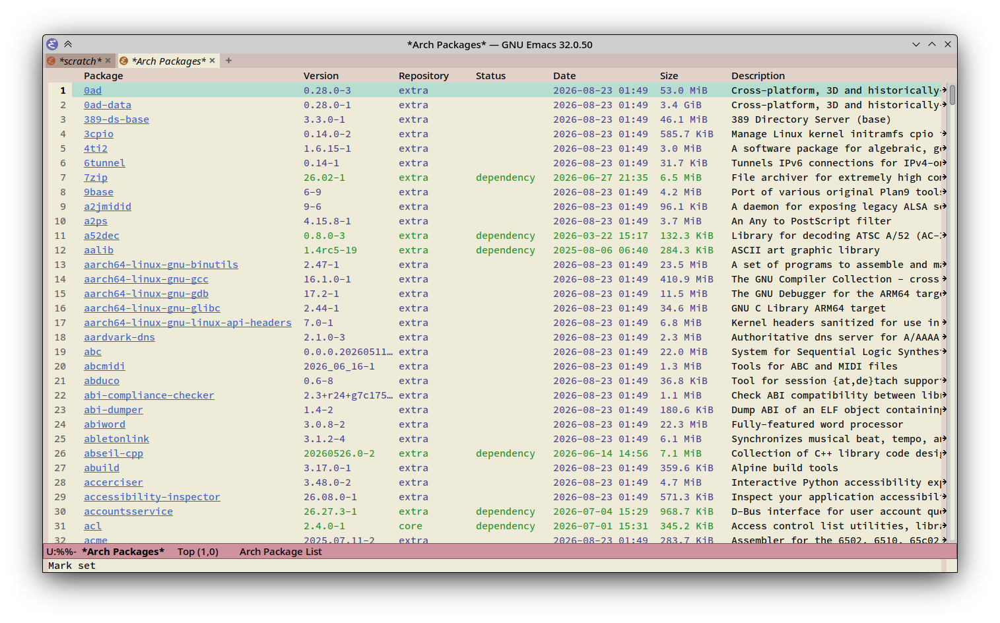
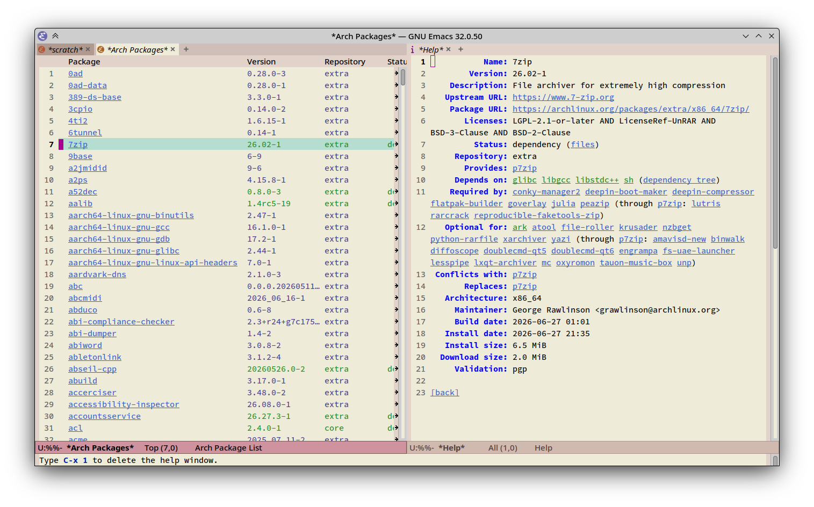
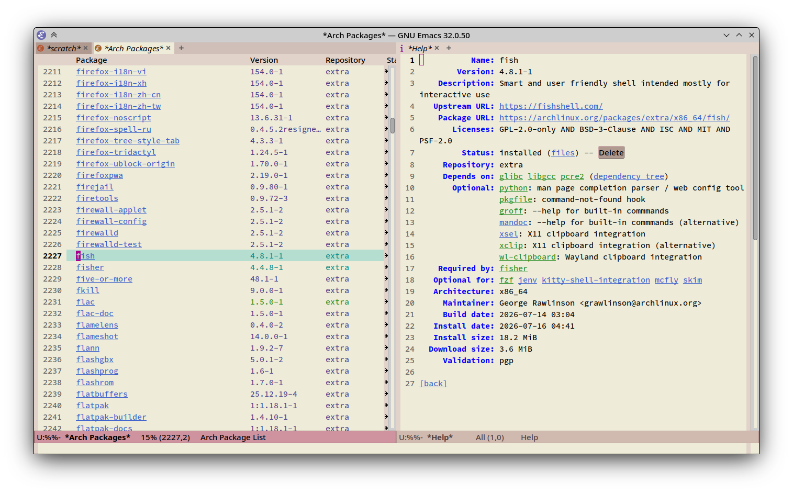
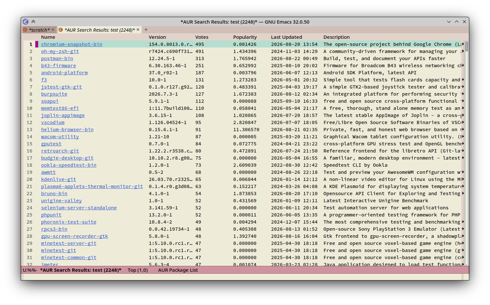
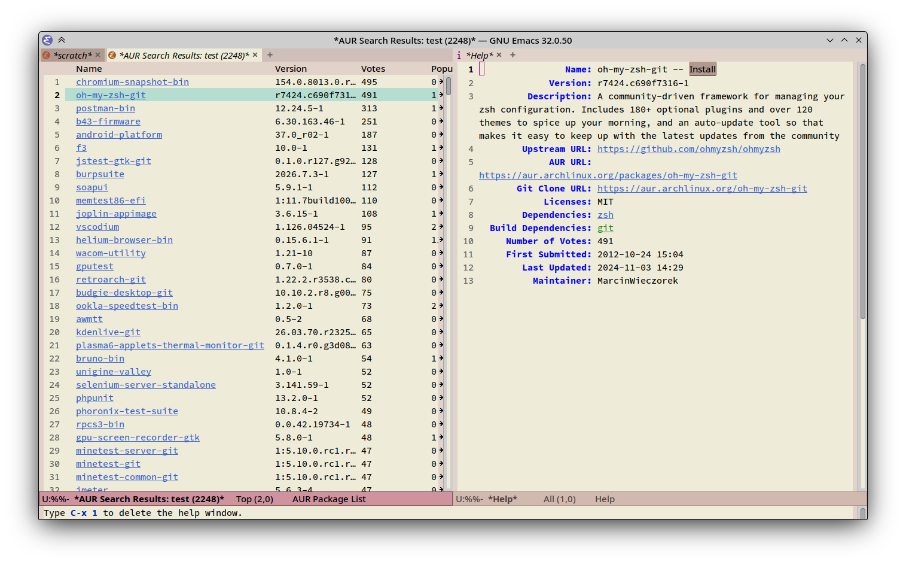

# arch-pkg

Browse Arch Linux packages in Emacs using an interface similar to built-in `package.el`.

<!--
(let ((commands '(arch-pkg-list-packages arch-pkg-aur-search))
      (variables '(arch-pkg-install-command arch-pkg-delete-command arch-pkg-aur-install-command)))
  (forward-line 2)
  (delete-region (point) (point-max))
  (insert "\n")

  ;; commands
  (insert "\n## Commands\n\n")
  (dolist (f commands)
    (insert "- `" (symbol-name f) "`: ")
    (insert (replace-regexp-in-string "\n\n" "\n" (documentation f)) "\n\n"))

  ;; variables
  (insert "\n## Variables\n\n")
  (dolist (v variables)
    (insert "- `" (symbol-name v) "`: ")
    (insert (replace-regexp-in-string
             "\n\n"
             "\n"
             (documentation-property v 'variable-documentation))
            (format " (default: `%s`)" (symbol-value v))
            "\n\n"))

  ;; screenshots
  (insert "\n## Screenshots\n\n")
  (dolist (file (cddr (directory-files "screenshots")))
    (insert (format "\n" (file-name-base file) file))))
-->

## Commands

- `arch-pkg-list-packages`: Display a list of Arch Linux packages.

- `arch-pkg-aur-search`: Search AUR repository for given QUERY.

## Variables

- `arch-pkg-install-command`: Package install command.  %s will be replaced with package name. (default: `sudo pacman -S %s`)

- `arch-pkg-delete-command`: Package delete command.  %s will be replaced with package name. (default: `sudo pacman -R %s`)

- `arch-pkg-aur-install-command`: Package install command for AUR.  %s will be replaced with package name. (default: `yay -S %s`)

## Screenshots

